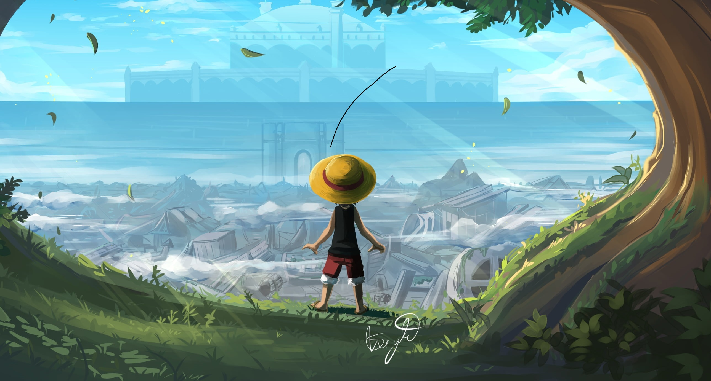

<h1 align="center">
  Salut, moi c'est [Ton Prénom] 👋
</h1>

<h3 align="center">
  Bienvenue sur mon profil GitHub !
</h3>

  

  

- 👋 Hi, I’m @joelmiandra46
- 👀 I’m interested in dev
- 🌱 I’m currently learning  les langage
- 💞️ I’m looking to collaborate on your project
- 📫 email:jojomiandra@gmail.com
- 

<!---
joelmiandra46/joelmiandra46 is a ✨ special ✨ repository because its `README.md` (this file) appears on your GitHub profile.
You can click the Preview link to take a look at your changes.
--->

### 🚧 I’m currently building...

- 🔧 Des apps **Symfony** robustes et scalables côté back
- 🎨 Des interfaces dynamiques avec **Vue.js** + **Twig**
- 🛢️ Des systèmes bien structurés avec **MySQL**
- 💻 Des outils desktop ou API en **C#**
- 📚 Des projets personnels et open source pour apprendre et partager

---

  

## 🛠️ Technologies & outils

- 
## 📈 Stats GitHub

### 💡 En savoir plus

- 💬 Toujours partant pour discuter dev, design ou side projects
- 📫 Contacte-moi : [jojomiandra@gmail.com](mailto:jojomiandra@gmail.com)
- 🎮 J’aime aussi les jeux, la musique, et tester des technos 🤖
### 🔥 Contributions & Activité

  
   
  

